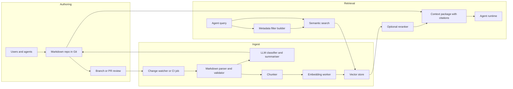
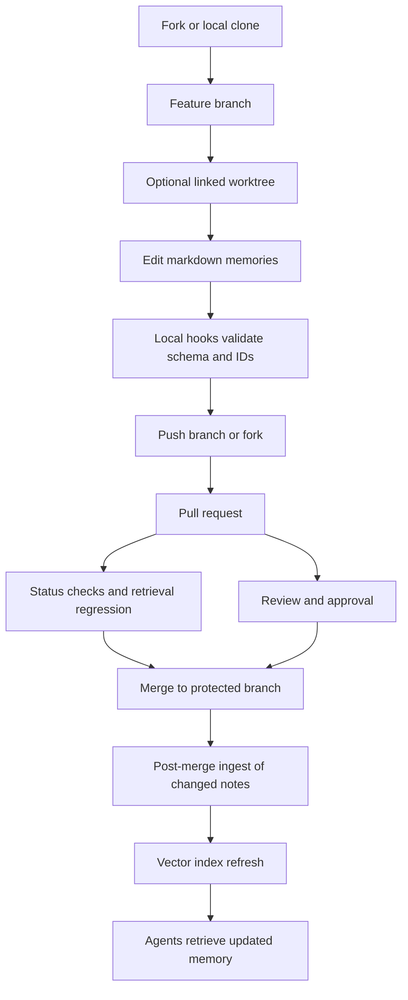

# Markdown-first memory systems for agent work assistance

## Executive summary

The strongest design for a durable agent memory system is **markdown-first, git-native, and index-derived**: Markdown files in Git are the source of truth; the LLM is used only to *extract, normalise, summarise, and categorise* memory into structured metadata; embeddings power semantic retrieval over chunked note content; and the vector store is treated as a **rebuildable projection**, not the authoritative record. That pattern combines the auditability and branching semantics of Git with the retrieval performance of ANN vector search, and it avoids coupling long-lived memory to a single database or model vendor. OpenViking is a useful reference point because it explicitly frames agent context as a filesystem, uses hierarchical context layers, supports semantic retrieval, and extracts six memory classes from sessions; however, for a Git-managed markdown repository you will usually want a simpler, more transparent variant in which plain files remain canonical. citeturn28search1turn28search0turn21view0turn19view6

A practical default architecture is: **Git repo + Markdown schema + ingest daemon + embedding/indexing worker + retrieval API + CI checks**. For local-first deployment, Chroma or Qdrant are the simplest vector layers to stand up on one machine; for managed cloud isolation and namespace-based multitenancy, Pinecone is operationally convenient; for Postgres-centric stacks, pgvector keeps operational complexity low at small-to-medium scale. FastAPI is a sensible API layer because it gives typed request models, OpenAPI/JSON Schema docs, and straightforward Uvicorn deployment. LangServe can still expose simple LangChain runnables as REST endpoints, but its own maintainers mark it deprecated and recommend LangGraph Platform for new deployments, so a plain FastAPI service is the safer long-term default. citeturn20view4turn20view5turn20view1turn19view5turn20view7turn31view1turn31view2turn31view3turn31view0

The main engineering conclusion is this: **optimise for mergeability and provenance before optimising for retrieval cleverness**. Put one memory atom per file, keep frontmatter stable and machine-validated, require source evidence for any LLM-written metadata, and drive incremental re-embedding from Git diffs and content hashes. For team workflows, use branches, pull requests, protected branches, required checks, and `rerere`; add a custom merge driver only for memory files; and reach for CRDTs or OT only if you truly need real-time concurrent editing rather than asynchronous Git collaboration. Git’s own tools already support custom merge drivers, worktrees, cherry-pick, revert, hooks, and recorded conflict reuse, while GitHub adds status checks, reviews, protected branches, forks, and PR workflows that fit this model well. citeturn21view1turn21view2turn21view3turn23view0turn23view1turn23view2turn21view4turn21view5turn24view0turn24view1turn25search0turn25search1turn25search2

Because the user did not specify an LLM or embedding provider, this report assumes a **provider-agnostic control plane**: the ingest service can call any structured-output-capable LLM, and the retrieval service can swap embeddings or vector stores as long as each note records its embedding model, dimensionality, version, and last index time. That assumption is material, because vector dimensionality is fixed at index/collection creation time in several stores and because provider-specific trade-offs differ sharply between hosted APIs and open-weight models. Qdrant collections, for example, require explicit vector size and distance when created; Pinecone indexes are created to match the embedding model characteristics; and pgvector exposes both HNSW and IVFFlat trade-offs directly inside Postgres. citeturn20view1turn19view6turn20view7

## Architecture and data flow

The recommended architecture is a **two-plane system**. The **control plane** manages source files, ingest, validation, and index refresh. The **query plane** serves retrieval to agents. The important boundary is that agents should read retrieved context through an API and should usually write memory by creating or editing markdown files that later pass through ingest; they should not mutate vector records directly except via tightly controlled maintenance tooling. This keeps audit trails, reversibility, and review where they belong: in Git. Git itself is inherently branch-and-merge oriented, and OpenViking’s filesystem-oriented design reinforces the value of treating memory as a navigable, inspectable file hierarchy rather than opaque vector blobs. citeturn21view0turn28search1



A clean API surface is small. In practice, four endpoints are enough for the first production cut: `POST /ingest/changed-files`, `POST /retrieve`, `GET /memory/{id}`, and `GET /healthz`. FastAPI is well suited here because it is ASGI-native, standards-based, and auto-generates interactive docs; Uvicorn can run one or more worker processes, and FastAPI’s deployment guidance explicitly calls out worker replication as one way to exploit multi-core CPUs. If you need a chain-serving layer, LangServe exposes `/invoke`, `/batch`, and `/stream` endpoints, but its maintainers now advise new projects to prefer LangGraph Platform, so there is little reason to make LangServe the architectural centre of a new memory service. citeturn31view1turn31view2turn31view3turn31view0

OpenViking is especially relevant as a conceptual benchmark. Its documentation describes a **filesystem paradigm**, `viking://` URIs, hierarchical L0/L1/L2 loading, directory-recursive retrieval, and six automatically extracted memory classes: **profile, preferences, entities, events, cases, patterns**. Those ideas map well to a markdown system if you reinterpret them as: flat file storage in Git, progressively richer note representations, path-aware filtering before vector search, and a stable core taxonomy for categorisation. Its own local setup also shows a small host/port server with a workspace directory, embedding configuration, and automatic memory capture/recall controls, which is close to the kind of local developer mode most teams want. citeturn28search1turn28search0

My recommendation is therefore to adopt **OpenViking’s information architecture, not necessarily its entire runtime**. In other words: use a filesystem-shaped memory namespace, keep a coarse summary layer and a detailed body layer, and encode enough metadata to allow directory- and tag-constrained retrieval before semantic search. That keeps retrieval explainable and debuggable, which matters because ANN systems always expose a quality/latency trade-off rather than exact search. Weaviate’s own ANN documentation makes this explicit, including recall/QPS and latency trade-offs under different HNSW settings. citeturn28search1turn27view4turn27view5

## Markdown schema and repository design

For Git friendliness, the file system should be **topic-oriented and atomised**, not monolithic. One note should represent one memory unit or one tightly related cluster that is likely to be reviewed, reverted, cherry-picked, or merged together. That design is not stated by any one product doc, but it follows directly from Git’s object and merge model: `git merge` integrates histories; `git cherry-pick` applies existing commits as new commits on another branch; and `git revert` adds new commits reversing earlier ones. Smaller, purpose-specific files make those operations materially safer. citeturn21view0turn23view0turn23view1

A recommended repository shape is:

```text
memory-repo/
  memory/
    people/
    projects/
    decisions/
    meetings/
    incidents/
    patterns/
    references/
  schemas/
    memory-note.schema.json
  scripts/
    ingest.py
    merge_markdown.py
    validate_frontmatter.py
  .gitattributes
  .github/
    workflows/
      validate-memory.yml
      retrieval-regression.yml
```

The key rule is that the **markdown file is canonical**, while everything else is either validation, automation, or rebuildable index state. Do not commit generated chunk files or vector payload exports to the main repo unless you have a very specific archival reason. Pinecone, Qdrant, and Chroma all support storing IDs plus filterable metadata beside vectors; Git already preserves the durable history and reviewable diff that those systems do not replace. Pinecone’s record model, for example, requires an ID, a vector, and optional flat key-value metadata; nested JSON is not supported in metadata. That is a strong reason to keep rich structure in markdown/frontmatter and project only the flat fields you actually query into the vector layer. citeturn19view7turn19view4

A frontmatter template that works well for this use case is:

```yaml
---
id: mem_01JX3Y1Y8H6TR4Y3Q38K1W9P2A
schema_version: 1
title: "Decision to standardise retrieval on hybrid search"
type: decision
status: active
created_at: 2026-05-14T18:42:00Z
updated_at: 2026-05-14T18:42:00Z
authors:
  - leonard
owners:
  - platform-ai
visibility: team
tenant: acme
project: memory-system
tags:
  - retrieval
  - architecture
  - decision
categories:
  - decision
  - pattern
entities:
  - hybrid-search
  - pinecone
  - qdrant
summary: >
  Team decided to use metadata filtering plus vector search plus optional reranking
  for agent memory retrieval, with markdown in Git as the source of truth.
source_refs:
  - kind: pr
    value: "#128"
  - kind: meeting
    value: "meeting-2026-05-14-arch-review"
evidence_spans:
  - "use metadata filtering plus vector search plus optional reranking"
confidence: 0.93
pii: none
content_hash: "sha256:..."
embedding:
  model: "voyage-3-large"
  dimensions: 1024
  indexed_at: 2026-05-14T18:45:30Z
  version: "emb-v3"
lineage:
  supersedes: []
  related:
    - mem_01JX2...
---
```

And a corresponding note body can stay human-readable:

```markdown
# Decision

We will keep markdown files in Git as the canonical memory record.

## Rationale

Line-based history, pull-request review, cherry-pick, revert, and branch-level experimentation
are all substantially easier when memory remains a normal file rather than a database row.

## Retrieval implications

The retrieval API will project a flat subset of metadata into the vector store and use semantic
search only after tenant, project, and visibility filters have been applied.

## Review notes

Approved in architecture review on 2026-05-14.
```

This schema deliberately separates **identity**, **governance**, **retrieval metadata**, **evidence**, and **index bookkeeping**. The most important fields are `id`, `schema_version`, `visibility`/`tenant`/`project`, `categories`, `evidence_spans`, `content_hash`, and the `embedding` block. Those are what let you validate schema changes, enforce access control, detect stale embeddings, and know whether a summary came from evidence in the note or from unsupported model invention. For Git-aware workflows, it is also worth recording lineage such as `supersedes` or `related`, because later `cherry-pick` or `revert` operations will then remain intelligible at the document level as well as the commit level. citeturn23view0turn23view1turn21view6

For merge control, `.gitattributes` should identify memory files as text and attach a memory-specific merge driver:

```gitattributes
memory/**/*.md text eol=lf diff=markdown merge=memmd
```

Git natively supports built-in `text`, `binary`, and `union` low-level merge drivers and also supports custom merge drivers defined in Git config using `%O`, `%A`, `%B`, and `%P` placeholders. That makes it straightforward to write a driver that merges YAML frontmatter field-by-field first and markdown body sections second. citeturn21view1

## Retrieval layer and embedding strategy

The retrieval layer should be **hybrid, filtered, and incremental**. In concrete terms, that means: build metadata filters first; run semantic search only inside the permitted slice; optionally combine with keyword/full-text signals; and, for high-value interactions, rerank the short candidate set before returning context to the agent. Pinecone’s docs explicitly present two-stage retrieval as “query first, rerank second”, and they also expose full-text search, dense vectors, sparse vectors, and metadata filters inside the same broader retrieval design space. That is the correct shape for agent memory too: semantic search alone is usually not enough for precise work assistance. citeturn30search6turn19view6turn19view4

Chunking should follow **Markdown structure before token length**. The recommended sequence is: split first by heading boundaries; preserve title, section heading path, and frontmatter-derived facets in each chunk payload; then cap chunk size inside each section. As a design recommendation, use two chunk granularities rather than one: a **coarse chunk** for conceptual notes and a **finer chunk** for logs, meetings, or long incident timelines. OpenViking’s L0/L1/L2 model is useful inspiration here: keep a compact abstract, an intermediate overview, and full detail so retrieval can return the right level of memory without always paying full-token cost. citeturn28search1

The most important embedding decision is not just model quality. It is the combination of **quality, dimension, context length, hosting model, and index cost**. Lower dimensions reduce storage and often improve latency, but can hurt recall; Matryoshka-capable models are attractive because they let you down-project embeddings while preserving much of the ranking signal. Qdrant, Pinecone, and pgvector all make vector size an index-time concern, so changing dimensions is operationally meaningful rather than cosmetic. citeturn20view1turn19view6turn20view7turn4view0turn18view3

The table below compares representative embedding options appropriate for a markdown memory system.

| Model | Hosting mode | Notable properties | Dimensionality and context | Best fit | Sources |
|---|---|---|---|---|---|
| Voyage `voyage-3-large` | Hosted API | General-purpose, multilingual, strong retrieval performance | Official docs describe 32k context and configurable output dimensions around a 1024-d default | Strong default for hosted, high-quality semantic retrieval | citeturn18view3 |
| Nomic `nomic-embed-text-v1.5` | Open weights / local-friendly | Long context and Matryoshka-style resizing | Official model card documents 8192-token input and dimension reduction from 768 down to smaller sizes | Best for local or privacy-sensitive deployments that want dimension control | citeturn4view0 |
| BAAI `bge-large-en-v1.5` | Open weights | Mature English-focused retrieval model | Official model card documents 1024 dimensions and shorter input length than the long-context options | Good low-cost open model for English-heavy repos | citeturn4view3 |
| Cohere embed family | Hosted API | Broad provider support and simple managed integration | Official docs expose configurable embedding functions and Cohere also offers a separate rerank family for second-stage ranking | Good when you want one hosted vendor for embeddings plus reranking | citeturn20view6turn30search1turn30search4 |

In retrieval practice, a reranker is often the highest-leverage quality upgrade after metadata filtering. Pinecone, Cohere, and Voyage all document reranking as a second-stage relevance refinement over preliminary vector search results. For work-assistance memory, reranking is most useful when the query is underspecified, when documents are long, or when several candidate memories are semantically adjacent. Use it selectively rather than on every request, because it adds latency and cost. citeturn30search6turn30search1turn30search2turn30search8

The vector-store choice should follow your operational constraints more than benchmark fashion. The most relevant trade-off is not “best ANN engine in the abstract”; it is **managed isolation versus local simplicity versus SQL adjacency versus deep tuning**.

| Store | Operational model | Strengths for markdown memory | Main cautions | Best fit | Sources |
|---|---|---|---|---|---|
| Pinecone | Managed cloud | Namespaces for multitenancy, metadata filters, backups, reranking, dense/sparse/full-text patterns in one product family | Metadata must be flat JSON; large-namespace filtering strategies matter for cost and latency | Teams that want low-ops managed search with strong tenant isolation | citeturn19view5turn19view4turn19view6turn19view7turn19view3turn30search6 |
| Qdrant | Self-hosted or cloud | Clear payload filtering, multitenancy guidance, explicit HNSW tuning, snapshots for restore/migration | More infrastructure ownership than managed services | Strong local-first or self-hosted team deployments | citeturn20view0turn20view1turn20view2 |
| Chroma | Local dev or server-backed | Very easy local start, persistent on-disk client, HTTP server mode, embedding-function config persisted with collection | Docs explicitly say local persistent mode is for development/testing and production should prefer server-backed | Fastest path to a developer workstation prototype | citeturn20view3turn20view4turn20view5turn20view6 |
| pgvector | Postgres extension | SQL joins, transactional metadata, HNSW and IVFFlat in the same database you may already run | Recall/speed tuning is your responsibility; can become harder at very large scale | Excellent if memory metadata already belongs in Postgres | citeturn20view7 |
| Weaviate | Self-hosted or cloud | Transparent ANN tuning guidance and explicit recall/QPS/latency benchmarking | ANN quality varies with HNSW settings and dataset shape; you must tune intentionally | Good when you want strong ANN tuning visibility | citeturn27view4turn27view5 |

For **update and refresh policy**, use an incremental indexer driven by Git diffs and content hashes. Concretely: if `content_hash` changes, re-run summarisation/classification and re-embed; if only frontmatter ACL fields change, update vector metadata without re-embedding; and when you change embedding model or dimensionality, write a new `embedding.version` and reindex in the background against a parallel collection/index instead of mutating in place. This is a design recommendation, but it is strongly supported by the way these stores model vectors and metadata separately and by the fact that Pinecone, Qdrant, and other stores support bulk upsert/import and snapshot/backup flows. citeturn19view7turn19view3turn20view2

## Ingest pipeline and prompts

The ingest pipeline should be **extractive first, generative second**. The operational sequence I recommend is:

1. Detect changed notes from a commit, PR diff, hook, or scheduled scan.
2. Parse frontmatter and validate schema.
3. Run LLM extraction on the note body to produce **structured JSON only**.
4. Require the model to emit **evidence spans copied from the source note** for every non-trivial field.
5. Run deterministic post-validation: allowed labels, timestamp format, tag normalisation, entity dedupe, maximum summary length, and PII policy.
6. Write back only validated metadata fields.
7. Chunk and embed the body plus selected headings/summary.
8. Upsert vectors with flat queryable metadata and note/chunk IDs.
9. Record index version, model, dimensions, and timestamp in frontmatter or a separate system index.  

This style mirrors OpenViking’s automatic session memory extraction but keeps the result inspectable as markdown plus metadata instead of hiding it inside a framework runtime. citeturn28search1turn28search0

A practical core taxonomy is to adopt OpenViking’s six categories as the base and extend them for explicit work artefacts. In other words: **profile, preferences, entities, events, cases, patterns** as the stable semantic base, plus **decisions, tasks, references, risks, and policies** as work-oriented overlays. The base six are documented by OpenViking; the work overlays are a recommendation for engineering teams that need memory to support active delivery rather than long-horizon chat alone. citeturn28search1

A sample ingest prompt:

```text
System:
You are a memory-ingest classifier for a markdown knowledge repository.

Return JSON only.

Rules:
- Use only the supplied markdown body and frontmatter.
- Do not infer facts that are not directly supported by the note.
- If unsure, abstain by returning empty arrays or nulls.
- Every populated field must include at least one evidence span copied verbatim from the note.
- Keep summaries factual and compact.
- Allowed core categories:
  ["profile","preferences","entities","events","cases","patterns",
   "decisions","tasks","references","risks","policies"]

Required JSON shape:
{
  "title": string,
  "summary": string,
  "categories": string[],
  "tags": string[],
  "entities": [{"name": string, "type": string}],
  "claims": [{"text": string, "evidence_spans": string[]}],
  "pii": "none" | "low" | "moderate" | "high",
  "confidence": number
}

User:
<frontmatter and markdown body here>
```

A corresponding summarisation prompt variant can be stricter still:

```text
System:
Summarise the note in at most 60 words.
Do not add information not present in the note.
Prefer nouns and outcomes over narrative filler.
If the note is ambiguous, say so.
Return JSON: {"summary": "...", "evidence_spans": ["..."]}

User:
<markdown body>
```

The reason for this extra strictness is hallucination control. A memory system is uniquely vulnerable to *self-poisoning*: one unsupported extraction can be embedded, retrieved later, and treated by an agent as if it were established fact. The best mitigations are therefore architectural rather than rhetorical: structured machine output, evidence-span requirements, deterministic validators, confidence thresholds, and review gates for low-confidence or high-impact note types such as decisions and policies. That is an inference from the operational risks of LLM pipelines, but it also aligns with how typed API layers such as FastAPI and LangServe emphasise schema enforcement and validation at boundaries. citeturn31view1turn31view0

One additional recommendation is to distinguish **human-authored** from **machine-derived** fields. For example, keep `title`, `body`, `owners`, and `source_refs` human-editable; keep `summary`, `categories`, `embedding.*`, and `content_hash` machine-managed; and reject PRs where the machine-managed block is hand-edited without using the ingest tooling. Git hooks and CI are designed precisely for this kind of policy enforcement: pre-commit hooks can abort local commits, pre-merge checks can block merges, and status checks on GitHub can be required before protected branches accept changes. citeturn21view2turn21view4turn21view5

## Git integration, conflict resolution and multi-user workflows

A markdown memory repository should be built to support **cherry-pick, revert, worktrees, forks, PR review, and recorded conflict reuse** from the outset. Git’s command set already provides the right primitives. `git worktree` lets one repository hold multiple checked-out branches at once; `git cherry-pick` applies specific existing commits as new commits elsewhere and supports `-x` to append provenance for public backports; `git revert` creates new commits that reverse earlier ones without rewriting shared history; and `git rerere` records manual conflict resolutions and reapplies them when the same conflict shape recurs. citeturn21view3turn23view0turn23view1turn23view2turn23view3



The file layout should support these operations directly. The most important design rules are:

- Keep **one memory atom per file**.
- Avoid large append-only omnibus files for unrelated topics.
- Store reviewable, terse metadata in frontmatter rather than in external sidecars when possible.
- Ensure files are path-stable enough that moving a note is uncommon.
- Prefer topic folders over date-only folders, because backporting and cherry-picking by topic is usually easier than by chronology.

That is partly a design judgement, but it follows from the mechanics of Git’s merge and patch application: the smaller and more cohesive the change unit, the more safely it can be cherry-picked or reverted. citeturn21view0turn23view0turn23view1

The most useful Git commands in daily operation are:

```bash
# parallel work on a second branch without recloning
git worktree add ../memory-hotfix -b memory-hotfix origin/main

# enable conflict-resolution reuse
git config rerere.enabled true

# create a feature branch
git switch -c memory/add-incident-taxonomy

# backport one reviewed memory commit and keep provenance
git cherry-pick -x <commit-sha>

# revert a faulty shared-memory change safely
git revert <commit-sha>

# define upstream for a fork
git remote add upstream https://github.com/ORIGINAL-OWNER/ORIGINAL-REPOSITORY.git
git fetch upstream

# sync a fork branch with GitHub CLI
gh repo sync YOUR-USER/YOUR-FORK -b main
```

For merge handling, there are several viable strategies, but they solve different problems.

| Strategy | How it works | Strengths | Weaknesses | Best use in markdown memory | Sources |
|---|---|---|---|---|---|
| Git built-in text merge | Standard three-way line merge | Native, simple, universal | Conflict markers on overlapping edits; no structure awareness | Default baseline for most notes | citeturn21view1 |
| Git custom merge driver | External program merges `%O/%A/%B` for selected files | Can merge frontmatter structurally and body semantically | You must build, test, and maintain it | Best default upgrade for memory files | citeturn21view1 |
| Git `rerere` | Reuses recorded manual resolutions | Very effective for repeated long-lived branch conflicts | Only helps after first manual resolution | Strong complement to custom drivers | citeturn23view2turn23view3 |
| Semantic merge tools | Parse language/file structure before merge | Excellent for supported source-code languages and refactors | Official semantic tools are code-oriented and language-dependent; markdown support is weak | Limited value for plain markdown beyond specialised tooling | citeturn33view5turn33view6 |
| CRDT | Concurrent local-first state merges automatically | No central merge step, real-time collaboration | Natural document format is CRDT/JSON state, not plain Git markdown | Use only if you need live co-editing | citeturn33view0turn33view1turn33view2 |
| OT | Server-coordinated transformation of concurrent edits | Mature for realtime editors over JSON/text | Requires coordinating server and operation model | Use for Google-Docs-style editing, not normal Git PRs | citeturn33view3 |

The practical recommendation is: **start with Git text merge + custom memory merge driver + `rerere`**. Reserve CRDT or OT for situations where people need simultaneous live editing of the same note. Automerge and Yjs both document automatic conflict-free merging for shared state and are excellent technologies, but they are a better fit for collaborative editors than for a Markdown-in-Git source of truth. If you do need real-time collaboration, the best pattern is usually a **CRDT editing layer that periodically materialises canonical markdown snapshots into Git**, rather than replacing Git wholesale. That final materialisation step is an inference, but it follows directly from CRDTs’ JSON-like internal state model and Git’s strength in reviewable file history. citeturn33view0turn33view1turn33view2

For multi-user governance, use standard GitHub controls: forks where contributors lack direct write access; upstream remotes to sync forks; PRs for discussion; required status checks and protected branches for safe merges; and PR reviews or CODEOWNERS for sensitive memory areas such as `decisions/` and `policies/`. GitHub’s documentation is explicit that status checks can be required before merging protected branches, that PR reviews can be required, and that forks are the normal contribution model for users without write access. citeturn21view4turn21view5turn24view0turn24view1turn25search0turn25search3turn25search11

## Operations, security, evaluation and roadmap

From an operational perspective, the two scalable levers are **incremental indexing** and **bounded retrieval fan-out**. ANN systems do not promise exact nearest neighbours; they trade recall against latency and throughput. Weaviate’s benchmark documentation is explicit about balancing recall, QPS, mean latency, and p99 latency with HNSW settings, and its FAQ explains that changing `ef` changes recall and latency. pgvector likewise documents HNSW versus IVFFlat trade-offs. In practice, that means you should tune for the memory workload you actually have rather than accepting defaults blindly. citeturn27view4turn27view5turn20view7

Local service deployment is straightforward. FastAPI can be run with Uvicorn manually, and FastAPI documents both single-process and multi-worker deployment. Chroma documents `chroma run --path /db_path` for client-server mode and also offers `PersistentClient` for local on-disk development, while explicitly recommending server-backed Chroma for production. A good local stack therefore looks like: FastAPI retrieval/ingest API on `localhost:8000`, Chroma or Qdrant on a local port, the markdown repo in a normal working directory, and a background watcher or CI task to index changed notes. citeturn31view2turn31view3turn20view4turn20view5

Security and privacy should be policy-driven rather than bolted on. The non-negotiable practices are:

- **Data minimisation**: keep only personal data that is necessary for the stated memory purpose.
- **No sensitive-content logging**: logs commonly contain sensitive or personal data and must be protected from misuse.
- **Tenant/project/visibility filters before semantic search**: never retrieve globally and then trust the agent to ignore forbidden context.
- **Separate authorisation from ranking**: retrieval relevance should never override ACLs.

Those principles are directly supported by regulatory and security guidance. The ICO’s guidance on data minimisation says personal data should be limited to what is necessary, and the EDPS defines the same principle from GDPR Article 5(1)(c). OWASP’s logging guidance warns that logs may contain personal and other sensitive information and must be protected; its Top 10 2025 logging category explicitly includes insertion of sensitive data into log files as a failure mode. citeturn26search1turn26search9turn26search5turn26search14

For access control in the vector layer, the best pattern depends on store type. Pinecone’s guidance is clear that multitenancy is best implemented with **one namespace per tenant** in serverless indexes and that large per-user metadata-filter lists are an anti-pattern because they increase cost and latency. Qdrant supports payload-based filtering such as `group_id`, and its multitenancy guidance also discusses HNSW calibration to avoid a global index bottleneck. Chroma clients additionally expose `tenant` and `database` fields in client configuration. The architectural implication is simple: put **hard tenant boundaries** into namespaces or collections where the store supports them, then use metadata filters for project, visibility, document type, or tags inside that boundary. citeturn19view5turn20view1turn20view5

Backups and migration should assume the vector store is disposable but also restorable. Git gives you the authoritative history of markdown memories; Qdrant supports collection snapshots and restore for migration; Pinecone supports backups of serverless indexes; and local Chroma persists to disk if you use `PersistentClient`, though for production the safer pattern is a server-backed instance plus normal infrastructure backups. The operational recommendation is therefore: back up **both** the Git remote and the vector layer, but design so that the vector layer can always be rebuilt from Git if necessary. citeturn20view2turn19view3turn20view5

Testing and evaluation should cover both retrieval quality and system behaviour. Ragas documents **context precision** and **context recall** as retrieval metrics, and LangSmith documents an evaluation workflow built around datasets, evaluators, experiments, and online monitors over production traces. For a memory system, the minimum useful metric set is:

- retrieval: Recall@k or context recall, context precision, latency, p95/p99, stale-index rate;
- generation support: citation coverage, unsupported-claim rate, answer grounding rate;
- operations: ingest success rate, merge-conflict rate, reindex lag, duplicate-ID rate;
- governance: ACL leakage tests, PII-policy violations, unauthorised retrieval attempts.

That evaluation split matters because good vector recall can coexist with bad agent use of retrieved memory, and vice versa. citeturn27view0turn27view1turn27view2turn27view3

A realistic implementation roadmap is:

| Milestone | Deliverable | Main risks | Estimated effort |
|---|---|---|---|
| Foundation | Repo layout, markdown schema, frontmatter validator, basic FastAPI service | Schema churn; overfitting early taxonomy | Medium |
| Ingest v1 | Changed-file detector, LLM extraction, summaries, categories, evidence spans, embedding worker | Hallucinated metadata; poor prompt discipline | Medium |
| Retrieval v1 | Metadata filters, semantic search, note/chunk citations, agent context package | Weak ranking without reranking; ACL mistakes | Medium |
| Git hardening | `.gitattributes`, custom merge driver, `rerere`, hooks, protected branches, status checks | Merge driver complexity; user bypass of local hooks | Medium |
| Quality hardening | Retrieval regression suite, context precision/recall dashboards, PR checks on memory changes | Synthetic tests not matching real usage | Medium |
| Security hardening | Tenant namespaces/collections, PII redaction policy, sensitive-log scrubbing, backup automation | Hidden PII in free text; incomplete access rules | Medium |
| Advanced collaboration | CRDT or OT overlay for real-time note editing if required | Significant complexity; divergence from Git-native model | High |

The most important risks are not obscure infrastructure failures. They are **taxonomy sprawl**, **machine-authored falsehoods becoming durable memory**, **ACL leakage through sloppy filtering**, and **repository ergonomics degrading as note volume grows**. Those are manageable, but only if you keep the design disciplined: source of truth in markdown, generated state rebuildable, evidence required, and CI responsible for enforcing invariants that humans reliably forget. citeturn19view5turn19view7turn26search1turn26search5turn27view2

Open questions and limitations remain. The report assumes provider choice is open, but the exact LLM/embedding vendor will affect cost, data residency, and multilingual performance. It also assumes asynchronous Git collaboration is acceptable; if your real requirement is Google-Docs-style simultaneous editing, CRDT or OT becomes more central. Finally, while OpenViking is an important reference project for filesystem-shaped agent memory, its published benchmark summaries are somewhat inconsistent across pages, so its performance claims should be treated as directional rather than definitive until independently reproduced. citeturn28search0turn28search1